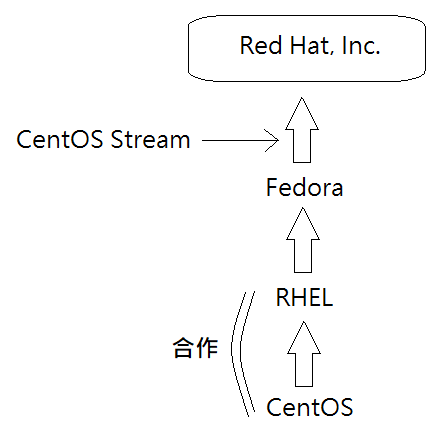

## 歷史

最早的 open source 是由 **GNU** 發起的

> * **GNU計劃（GNU Project）** 的目標是建立一套完全自由的作業系統
> * **GNU 作業系統**便是 GNU 計劃的主要目標，其內容軟體完全以 GPL 方式釋出
> * **GPL 公約**：產品都要開放原始碼

**GNU OS** = **tools(library) + kernel** 組合而成
* GNU當時已把 library 做完，但 kernel 遲遲未完成，直到芬蘭大學生完成 kernel 層 => **linux**
* 所以 **linux** 其實一開始是**實作 kernel 層**，只是後來被混用成 OS

## 生態

